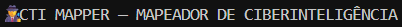
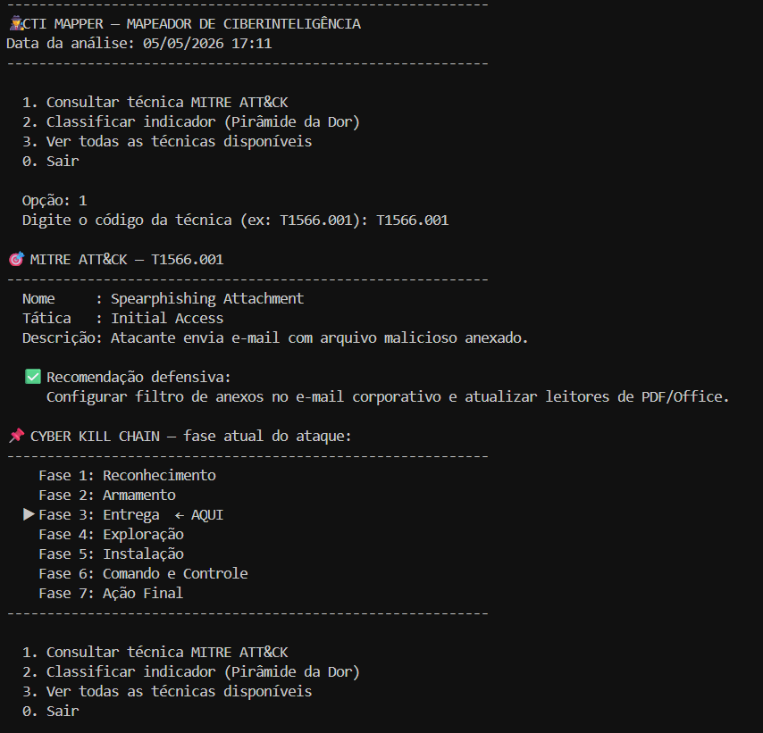
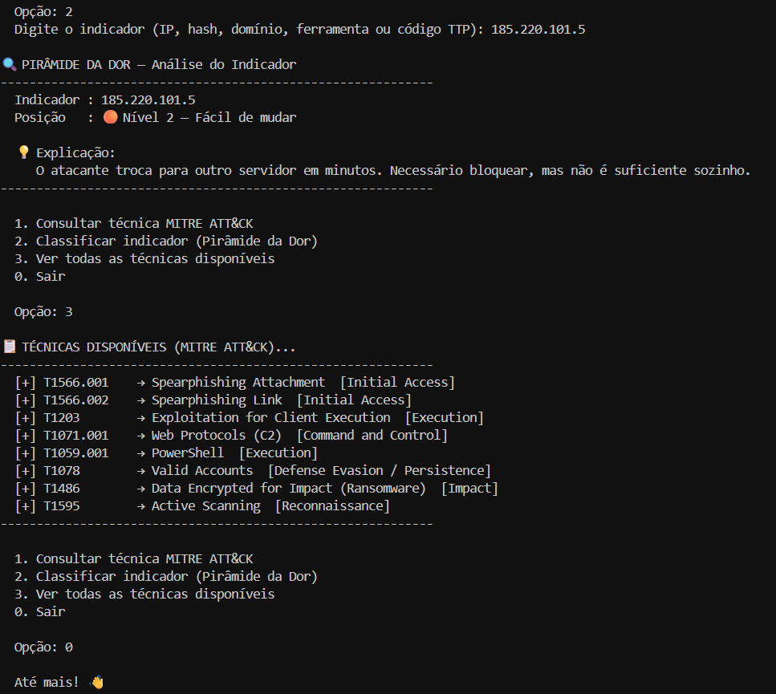

<p align="center">
  
</p>

<p align="center">
  
  
  
</p>

---

## 📖 Sobre a Origem do Projeto

Este é o terceiro de uma série de projetos que estou desenvolvendo como prática do curso **CIBERSEGURIDAD APLICADA: REGLAMENTOS, INTELIGENCIA Y DEFENSA**.

> Este curso ha sido ofrecido por **CIBERIA**, proyecto coordinado por la **Universidad de Salamanca**, cuyo objetivo es lograr la digitalización de empresas y organismos públicos de Castilla y León y el centro de Portugal (zona CENCYL).
>
> Para lograr un ecosistema seguro, ofrece servicios gratuitos entre los que destacan el Sello de Confianza, la monitorización continua (SOC) y el cumplimiento normativo obligatorio (CRA, NIS/NIS2).
>
> *Al registrarte aceptas recibir una comunicación en forma de asesoramiento sobre el Sello de Confianza y el SOC-T.*

---

## 🎯 O Porquê deste Projeto (Justificativa)

A **Ciberinteligência (CTI)** representa uma mudança de paradigma na segurança: em vez de apenas reagir a ataques, o objetivo é **antecipar** o comportamento do adversário.

Construí este mapeador para aplicar na prática três conceitos centrais do módulo:

- **MITRE ATT&CK:** framework que cataloga técnicas reais usadas por atacantes, organizadas por táticas.
- **Pirâmide da Dor:** modelo que classifica indicadores pelo custo que geram ao adversário quando bloqueados — quanto mais alto na pirâmide, mais difícil é para o atacante se adaptar.
- **Cyber Kill Chain:** modelo que descreve as 7 fases de um ataque, do reconhecimento à ação final, indicando onde a defesa pode (e deve) intervir.

A ferramenta conecta esses três modelos em uma interface de terminal interativa, permitindo ao analista consultar técnicas e classificar indicadores com recomendações defensivas práticas.

---

## 🚀 Funcionalidades

### 🎯 Consulta de Técnicas MITRE ATT&CK
O analista digita um código de técnica (ex: `T1566.001`) e recebe nome, tática, descrição, recomendação defensiva e posicionamento automático na Cyber Kill Chain.

### 🔍 Classificação pela Pirâmide da Dor
O analista digita um indicador (IP, hash MD5/SHA256, domínio ou nome de ferramenta) e a ferramenta identifica seu nível na pirâmide, explicando o impacto estratégico de bloqueá-lo.

### 📋 Listagem de Técnicas Disponíveis
Exibe todas as técnicas da base de dados local com código, nome e tática — útil para explorar o que pode ser consultado.

---

## 💻 Exemplos Práticos de Execução

**Consultando a técnica T1566.001 (Spearphishing Attachment) e sua posição na Kill Chain:**

<p align="center">
  
</p>

**Classificando um IP malicioso e listando todas as técnicas disponíveis:**

<p align="center">
  
</p>

---

## 🚀 Como Executar Localmente

Ferramenta desenvolvida 100% em Python padrão, sem necessidade de dependências externas.

1. Clone o repositório:
   ```bash
   git clone https://github.com/suares13/cti-mapper.git
   ```
2. Acesse a pasta do projeto:
   ```bash
   cd cti-mapper
   ```
3. Execute a ferramenta:
   ```bash
   python cti.py
   ```

---

## 👩‍💻 Autora

**Victória Santos Suares da Silva**
*Estudante de Engenharia de Software e Pesquisadora em IA Justa e Transparente.*
Foco em Segurança Ofensiva, Análise de Vulnerabilidades e Ciberdireito.

* **LinkedIn:** https://www.linkedin.com/in/victoria-suares/
* **GitHub:** [@suares13](https://github.com/suares13)
